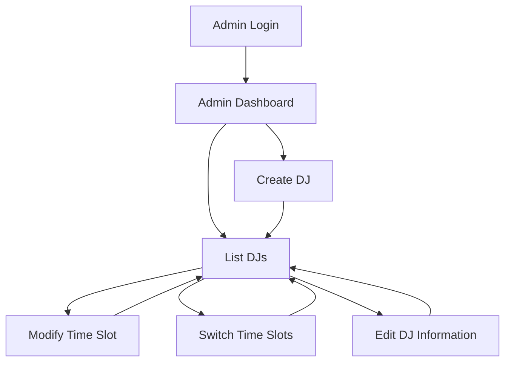
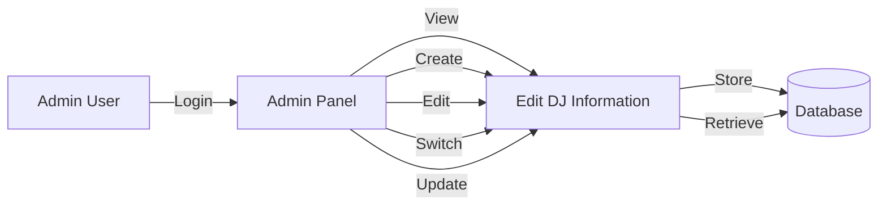

# Admin Sitemap

## Overview
The admin panel is designed for managing DJs and other administrative tasks. This document outlines the sitemap and key features of the admin panel.

---

## Admin Login
- **URL**: `/admin/login`
- **Description**: Admins can log in using the following credentials:
  - **Email**: `admin@ysl.com`
  - **Password**: `beautylightclub@2026`
- **Note**: Registration is disabled. Admin users are created using seeders.

---

## Admin Dashboard
- **URL**: `/admin`
- **Description**: The landing page after login. Displays an overview of the system.

---

## DJs Management
### List DJs
- **URL**: `/admin/djs`
- **Description**: Displays a list of all DJs with options to edit or delete.

### Create DJ
- **URL**: `/admin/djs/create`
- **Description**: Form for adding a new DJ with the following fields:
  - **Name**
  - **Video URL**
  - **Slot**

---

## Time Slot Management
- **Description**: Each DJ is assigned a specific time slot for their performance.
- **Fields**:
  - **Slot**: A string representing the time slot (e.g., "10:00 AM - 11:00 AM").
- **Features**:
  - Assign a time slot when creating a DJ.
  - View and edit time slots in the DJ list.
  - Ensure no overlapping time slots for DJs.

---

## Time Slot Management Features
- **Modify Time Slots**:
  - Admins can edit a DJ's time slot directly from the edit page.
  - Validation ensures no duplicate time slots.

- **Switch Time Slots**:
  - Admins can swap time slots between two DJs.
  - A dedicated form allows selecting two DJs to switch their slots.

- **Reschedule Time Slots**:
  - Admins can reschedule DJs to new time slots while ensuring no conflicts.

### Implementation Details
- **Routes**:
  - `POST /admin/djs/switch-slots`: Handles time slot switching.
  - `PUT /admin/djs/{id}`: Updates a DJ's time slot.

- **Validation**:
  - Unique constraint on `slot` column in the database.
  - Backend validation ensures no duplicate slots during updates or switches.

- **UI**:
  - Edit and switch forms are available in the admin panel for managing time slots.

---

## Time Slot Conflict Prevention
- **Database Constraint**: The `slot` column in the `djs` table has a unique constraint to prevent duplicate time slots.
- **Backend Validation**: The `store` method in the `DJController` validates that the `slot` is unique before saving.
- **Error Handling**: Validation errors, including time slot conflicts, are displayed in the admin UI when creating or editing a DJ.

---

## Future Features
- Additional admin functionalities can be added here as needed.

---

## Updated Sitemap Diagram

---

## Updated Data Flow Diagram (DFD)
