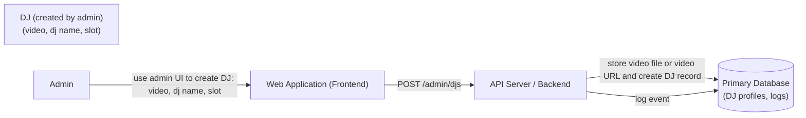

# Data Flow Diagram — DJ Web App (Mermaid)

```mermaid
flowchart LR
  %% === External Entities ===
  DJ["DJ (created by admin)\n(video, dj name, slot)"]
  Admin[Admin]

  %% === Processes / Services ===
  WebApp["Web Application (Frontend)"]
  API["API Server / Backend"]

  %% === Data Stores / Storage ===
  DB[("Primary Database\n(DJ profiles, logs)")]

  %% === Flows ===
  Admin -->|use admin UI to create DJ: video, dj name, slot| WebApp
  WebApp -->|POST /admin/djs| API
  API -->|store video file or video URL and create DJ record| DB
  API -->|log event| DB

  %% Add or refine nodes and arrows below as needed.
```

---