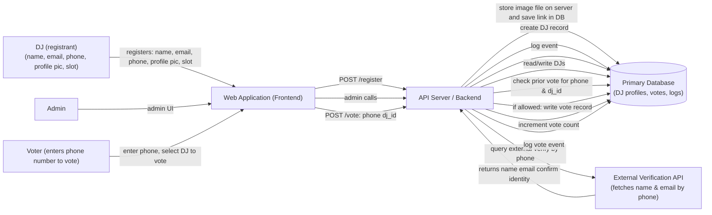

# Data Flow Diagram — DJ & Voter Web App (Mermaid)

Edit the placeholders below to match the app. This version reflects the DJ registration and voter verification flows you described.

```mermaid
flowchart LR
  %% === External Entities ===
  DJ["DJ (registrant)\n(name, email, phone, profile pic, slot)"]
  Voter["Voter (enters phone number to vote)"]
  Admin[Admin]
  ExternalVerify["External Verification API\n(fetches name & email by phone)"]

  %% === Processes / Services ===
  WebApp["Web Application (Frontend)"]
  API["API Server / Backend"]

  %% === Data Stores / Storage ===
  DB[("Primary Database\n(DJ profiles, votes, logs)")]

  %% === Flows ===
  DJ -->|registers: name, email, phone, profile pic, slot| WebApp
  WebApp -->|POST /register| API
  API -->|store image file on server and save link in DB| DB
  API -->|create DJ record| DB
  API -->|log event| DB

  Admin -->|admin UI| WebApp
  WebApp -->|admin calls| API
  API -->|read/write DJs| DB

  Voter -->|enter phone, select DJ to vote| WebApp
  WebApp -->|POST /vote: phone dj_id| API
  API -->|query external verify by phone| ExternalVerify
  ExternalVerify -->|returns name email confirm identity| API
  API -->|check prior vote for phone & dj_id| DB
  API -->|if allowed: write vote record| DB
  API -->|increment vote count| DB
  
  API -->|log vote event| DB

  %% Add or refine nodes and arrows below as needed.
```

---